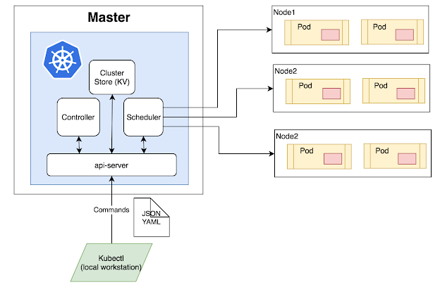

# kubernetes

KUBERNETES is a container management system developed in the Google platform. The purpose of kubernetes is to manage a containerized application in various types of Physical, virtual, and cloud environments. Google Kubernetes is a highly flexible container tool to deliver even complex applications, consistently. Applications run on clusters of hundreds to thousands of individual servers.

Google Kubernetes is highly flexible container tool to deliver even complex applications, consistently. Applications 'run on clusters of hundreds to thousands of individual servers.

## Features of Kubernetes

* Automated Scheduling
* Self-Healing Capabilities
* Automated rollouts & rollback
* Horizontal Scaling & Load Balancing
* Offers environment consistency for development, testing, and production
* Infrastructure is loosely coupled to each component can act as a separate unit
* Provides a higher density of resource utilization
* Offers enterprise-ready features
* Application-centric management
* Auto-scalable infrastructure
* You can create predictable infrastructure

## Kubernetes Basics

* Cluster:
        
It is a collection of hosts(servers) that helps you to aggregate their available resources. That includes ram, CPU, ram, disk, and their devices into a usable pool.

* Master:
        
The master is a collection of components which make up the control panel of Kubernetes. These components are used for all cluster decisions. It includes both scheduling and responding to cluster events.

* Node:
        
It is a single host which is capable of running on a physical or virtual machine. A node should run both kube-proxy, minikube, and kubelet which are considered as a part of the cluster.

        
## Kubernetes Architecture

  

**Master Node**

* The master node is the first and most vital component which is responsible for the management of Kubernetes cluster. It is the entry point for all kind of administrative tasks. There might be more than one master node in the cluster to check for fault tolerance.

* The master node has various components like API Server, Controller Manager, Scheduler, and ETCD. Let see all of them.

* API Server: The API server acts as an entry point for all the REST commands used for controlling the cluster.

   
**Scheduler**

* The scheduler schedules the tasks to the slave node. It stores the resource usage information for every slave node. It is responsible for distributing the workload.

* It also helps you to track how the working load is used on cluster nodes. It helps you to place the workload on resources which are available and accept the workload.

**Etcd**

* etcd components store configuration detail and wright values. It communicates with the most component to receive commands and work. It also manages network rules and port forwarding activity.

**Worker/Slave nodes**

Worker nodes are another essential component which contains all the required services to manage the networking between the containers, communicate with the master node, which allows you to assign resources to the scheduled containers.

* Kubelet: gets the configuration of a Pod from the API server and ensures that the described containers are up and running.
* Docker Container: Docker container runs on each of the worker nodes, which runs the configured pods
* Kube-proxy: Kube-proxy acts as a load balancer and network proxy to perform service on a single worker node
* Pods: A pod is a combination of single or multiple containers that logically run together on nodes

## Kubernetes vs. Docker Swarm

<table class="table table-striped"><tbody><tr><td><strong>Parameters</strong> </td><td><strong>Docker Swarm</strong> </td><td><strong>Kubernetes</strong> </td></tr><tr><td>Scaling </td><td>No Autoscaling </td><td>Auto-scaling </td></tr><tr><td>Load balancing </td><td>Does auto load balancing </td><td>Manually configure your load balancing settings </td></tr><tr><td>Storage volume sharing </td><td>Shares storage volumes with any other container </td><td>Shares storage volumes between multiple containers inside the same Pod </td></tr><tr><td>Use of logining and monitoring tool </td><td>Use 3rd party tool like ELK </td><td>Provide an in-built tool for logging and monitoring. </td></tr><tr><td>Installation </td><td>Easy &amp; fast </td><td>Complicated &amp; time-consuming </td></tr><tr><td>GUI </td><td>GUI not available </td><td>GUI is available </td></tr><tr><td>Scalability </td><td>Scaling up is faster than K8S, but cluster strength not as robust </td><td>Scaling up is slow compared to Swarm, but guarantees stronger cluster state Load balancing requires manual service configuration </td></tr><tr><td>Load Balancing </td><td>Provides a built-in load balancing technique </td><td>Process scheduling to maintain services while updating </td></tr><tr><td>Updates &amp; Rollbacks Data Volumes Logging &amp; Monitoring </td><td>Progressive updates and service health monitoring. </td><td>Only shared with containers in same Pod Inbuilt logging &amp; monitoring tools. </td></tr></tbody></table>

## Disadvantages of Kubernetes

* Kubenetes dashboard not as useful as it should be
* Kubernetes is a little bit complicated and unnecessary in environments where all development is done locally.
* Security is not very effective.

# Install Kubernetes on Ubantu

**Install Docker**

        curl -fsSL https://download.docker.com/linux/ubuntu/gpg | sudo apt-key add -

        sudo add-apt-repository \
           "deb [arch=amd64] https://download.docker.com/linux/ubuntu \
           $(lsb_release -cs) \
           stable"

        sudo apt-get update

        sudo apt-get install -y docker-ce=18.06.1~ce~3-0~ubuntu

        sudo apt-mark hold docker-ce
        
 To  verify that docker is working by running this command:
 
        sudo docker version
**Install Kubernetes**

        curl -s https://packages.cloud.google.com/apt/doc/apt-key.gpg | sudo apt-key add -

        cat << EOF | sudo tee /etc/apt/sources.list.d/kubernetes.list
        deb https://apt.kubernetes.io/ kubernetes-xenial main
        EOF

        sudo apt-get update

        sudo apt-get install -y kubelet=1.12.7-00 kubeadm=1.12.7-00 kubectl=1.12.7-00

        sudo apt-mark hold kubelet kubeadm kubectl
        
   To  verify that Kubeadm is working by getting the version info
   
        kubeadm version
        
## Resources
* Concepts

https://kubernetes.io/docs/concepts/

https://www.guru99.com/kubernetes-tutorial.html

        

